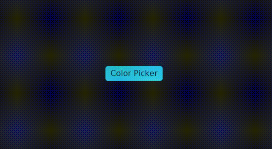

# iced_color_picker

A color picker widget for the [Iced](https://github.com/iced-rs/iced) GUI framework.

<div align="center">
  
</div>

## Features

- HSV color square canvas for color selection
- Hue slider with rainbow gradient
- Individual RGBA sliders for each color
- Multiple output formats: Integer, Float, Hex, Percent
- Clipboard copy of the formatted color value
- Optional color palette panel
- Overlay positioning (Center, Left, Right, Top, Bottom)
- Accepts any Iced `Element` as the trigger button

## Installation

Add the dependency to your `Cargo.toml`:

```toml
[dependencies]
iced_color_picker = { path = "path/to/iced_color_picker" }
iced = { git = "https://github.com/iced-rs/iced", rev = "4255f61", features = ["advanced", "canvas"] }
```

## Usage

### 1. Add `ColorPickerState` to your application

```rust
use iced_color_picker::state::{ColorPickerState, ColorPickerEvent, ContentMsg};

struct App {
    cp: ColorPickerState,
    opened: bool,
}

impl Default for App {
    fn default() -> Self {
        Self {
            // initial color: r=70, g=30, b=200
            cp: ColorPickerState::new(70, 30, 200),
            opened: false,
        }
    }
}
```

### 2. Define your message

```rust
#[derive(Debug, Clone)]
enum Message {
    SetOpened(bool),
    ColorPicker(ContentMsg),
}
```

### 3. Handle updates

```rust
fn update(&mut self, message: Message) -> iced::Task<Message> {
    match message {
        Message::ColorPicker(msg) => {
            match self.cp.update(msg) {
                Some(ColorPickerEvent::Submitted(color)) => {
                    self.opened = false;
                    println!("Color selected: {:?}", color);
                }
                Some(ColorPickerEvent::Cancelled) => {
                    self.opened = false;
                }
                Some(ColorPickerEvent::Copy(text)) => {
                    return iced::clipboard::write(text).discard();
                }
                None => {}
            }
        }
        Message::SetOpened(opened) => self.opened = opened,
    }
    iced::Task::none()
}
```

### 4. Build the view

```rust
use iced_color_picker::color_picker::{ColorPicker, Position};
use iced::widget::{button, center, container};

fn view(&self) -> iced::Element<'_, Message> {
    let content = self.cp.view(Message::ColorPicker);

    let btn = button("Pick a color");

    let cp = ColorPicker::new(
        btn,
        content,
        self.cp.current_color(),
        Position::Center,
    )
    .opened(self.opened)
    .on_open(Message::SetOpened)
    .gap(10)
    .style(container::rounded_box);

    center(cp).into()
}
```

## API

### `ColorPickerState`

| Method | Description |
|---|---|
| `new(r, g, b)` | Create state with an initial RGB color (alpha defaults to 255) |
| `current_color() -> [f32; 4]` | Return the current color as normalized RGBA floats |
| `current_color_text() -> String` | Return the color formatted according to the selected output format |
| `update(msg) -> Option<ColorPickerEvent>` | Apply an internal message |
| `view(wrap) -> Element` | Render the picker panel |

### `ColorPicker` widget

| Builder method | Description |
|---|---|
| `new(button, content, color, position)` | Create the widget |
| `.opened(bool)` | Control whether the overlay is visible |
| `.on_open(fn(bool) -> Message)` | Callback when the user opens or closes the picker |
| `.gap(f32)` | Gap between the button and the overlay |
| `.padding(f32)` | Padding inside the overlay container |

### `ColorValue`

Accepted input formats for the initial / selected color:

| Variant | Example |
|---|---|
| `Float([r, g, b, a])` | `[0.27, 0.12, 0.78, 1.0]` |
| `Integer([r, g, b, a])` | `[70, 30, 200, 255]` |
| `Hex(String)` | `"#461EC8FF"` |
| `Percent([r, g, b, a])` | `[27.0, 12.0, 78.0, 100.0]` |

### `ColorPickerEvent`

| Variant | Description |
|---|---|
| `Submitted([f32; 4])` | Returns RGBA color in selected format |
| `Cancelled` | Dismisses |
| `Copy(String)` | Clipboard copy returns text with the selected format |

## Example

Run the included example:

```sh
cargo run --example pick_the_color
```

## License

MIT

